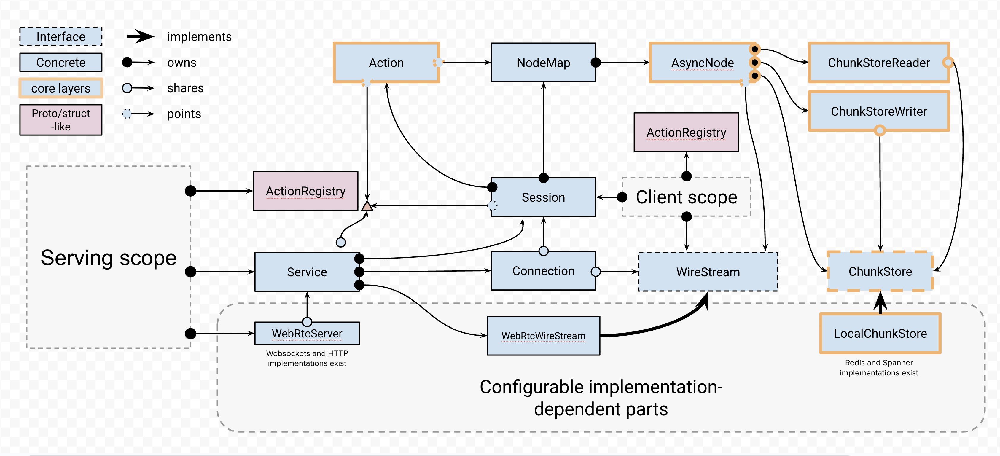

# Action Engine

Action Engine is a cross-language library for building interactive applications
that need streaming, multimodal, interactive capabilities. Think of:

- GenAI prototypes and fully served applications that need different media
  modalities and interactivity—image generation and editing, speech to text,
  etc.
- LLM agents that can interact with users and tools
- Native applications that need to interact with LLMs or just combine API calls
  asynchronously in a flexible way

The core library is written in C++, and there are bindings for Python with
almost complete feature coverage. A TypeScript library is also available for
building UIs that interact with the core library.

## Quickstart in Python

If there is a wheel already built for your platform, you can install Action
Engine
from PyPI (note that the package is still under development, so the API is not
stable yet):

```bash
pip install action-engine
python -c 'import actionengine; print(actionengine.to_chunk("Hello, world!"))'
```

Otherwise, you can install Action Engine directly from the GitHub repository.
First, make sure you have a recent C++20-compatible `clang` installed, then run:

```bash
pip install git+https://github.com/google-deepmind/actionengine -v
python -c 'import actionengine; print(actionengine.to_chunk("Hello, world!"))'
```

You can then explore the examples in the `examples` folder, such as
[007-python-generative-media](examples/007-python-generative-media), which
showcases how to build generative media applications with LLMs and text-to-image
models.

Action Engine requires Python 3.11 or higher.

## Features

- **Flexible unopinionated architecture** based on two core concepts:
    - **async nodes**, which are not more and not less than asynchronous data
      channels, with a *bring-your-own* storage system in mind,
    - **actions**, which are computations that transform data from input nodes
      to
      output nodes—and can produce side effects. This makes it easy to build
      complex data flows and interactions.
- **Agnostic to wire formats and connection contexts**: The core library does
  not care about how data is serialized or transmitted. This makes it easy to
  integrate with different transport layers, such as WebSockets, gRPC, or
  custom protocols.
    - WebSockets and WebRTC `WireStream`s are supported out of the box.
    - `msgpack` serialisation is implemented by default, with Protobuf
      definitions
      available for Action Engine data structures, and customisation points for
      application-specific data types.
- **Streaming-first**: Everything is designed to be streamed, from LLM outputs
  to images and audio. This enables low-latency, interactive applications.
- **Multimodal and extensible**: Supports text, images, audio, and can be
  easily extended to support other modalities. No architecture components are
  mandatory; you can pick and choose what you need, combining and extending as
  you see fit.
- **Cross-language**: Core library in C++ with bindings for Python and a
  TypeScript UI-centered library. Enables building applications in different
  environments: server backends, native apps, web UIs, peer-to-peer apps, etc.



## Getting started

### Core library and Python bindings

This library is under development, so the API is not stable yet, hence no
packages to install from PyPI or similar. To get started, clone this repo and
follow these steps:

1. Make sure you have CMake (version 3.22 or higher), clang with C++20 support,
   and ninja-build installed on your system.
2. Create and activate a Python virtual environment (optional but highly
   recommended).
3. Compile and install the PyBind11 bindings and the Python package:

   ```bash
   ./scripts/configure.sh
   ./scripts/build_python.sh
   ```
4. At this point, you should have an editable installation of the Python package
   `actionengine` in your virtual environment. This command should work:

   ```bash
   python -c "import actionengine; print('Action Engine imports successfully!')"
   ```

### Run a trivial C++ example

All examples are in the `examples` folder and can be built with CMake. For
instance, to build and run the `000-actions` example:

```bash
cd build
cmake --build . --target 000-actions
chmod +x examples/000-actions/000-actions
./examples/000-actions/000-actions
```

### Use the TypeScript library

The TypeScript library lives under the `js` folder. To get started, follow
these steps:

1. Make sure you have Node.js (version 23 or higher) and npm installed on your
   system.
2. Build the bundle:

   ```bash
   cd js
   npm install
   npm run build:bundle
   ```
3. Link the package for local development:

   ```bash
   npm link  # (or yarn link if you use yarn, for example)
   ```
4. Now you can use the package in your TypeScript projects by linking it:

   ```bash
   npm link actionengine  # (or yarn link actionengine)
   ```

Examples that use the TypeScript library to build UIs will be added soon.

## Demos and examples

At [examples/007-python-generative-media](examples/007-python-generative-media),
there is backend code for
several demo applications that showcase the capabilities of Action Engine. TBD:
insert images for [text to image](https://actionengine.dev/blob),
[deep research](https://actionengine.dev/deepresearch?q=alpha-demos) and
[stateful LLM conversations](https://actionengine.dev/gemini?q=ollama).

## Development log / to do list

- [ ] Set up CI and publishing pipelines for PyPI and docs
- [ ] Cover the essentials with tests
- [ ] Ensure no fatal errors and no hangs in basic session usage, including
  in Python bindings
- [ ] Propagate action status to all output nodes
- [ ] Make `ChunkStoreReader` and `ChunkStoreWriter` run tasks on a fiber
  pool, not own fibers
- [ ] Extend core PyBind11 bindings by more Pythonic interfaces more
  comprehensively; revise object ownership model
